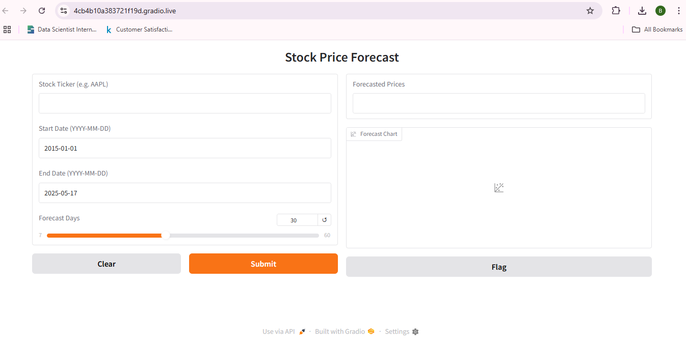
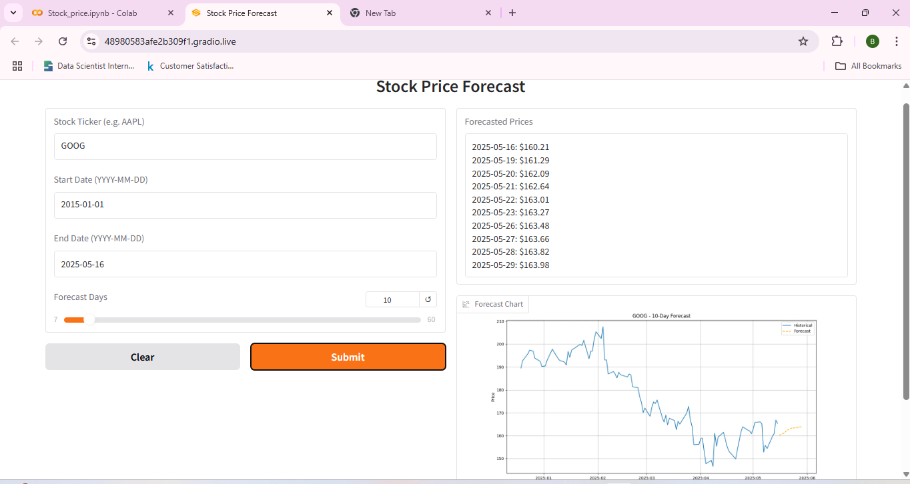

# 📊 Stock Price Prediction and Forecasting with LSTM

This project uses an LSTM neural network to predict future stock prices and visualizes the forecast with a user-friendly Gradio interface.

## User Interface

## 🚀 Features
- Predicts future stock prices using LSTM
- Interactive Gradio UI
- Historical and forecasted plots
- User input: Stock Ticker, date range, forecast period

## Example Output

## 📦 Dependencies
See `requirements.txt`

## Usage
Run the notebook or Python script and enter:
- Ticker symbol (e.g., AAPL)
- Start date
- End date
- Forecast days

